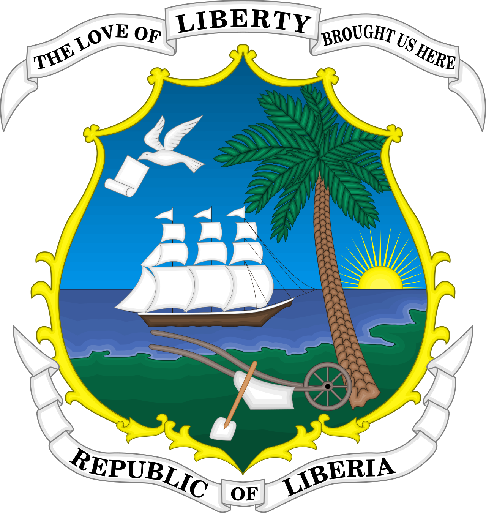

>**⚠️ Hardfork Notice**: This is a hardfork of [nightfox.nvim](https://github.com/EdenEast/nightfox.nvim).
>While we honor the original work by EdenEast, monrovia.nvim is now an independent project with:

<p align="center">
  
</p>

<h1 align="center">Monrovia</h1>

<p align="center">
  A highly customizable theme for neovim with support for lsp, treesitter and a variety of plugins.
</p>

<div align="center">
  <h3>Monrovia Night</h3>
  <h3>Monrovia Day</h3>
  <h3>Monrovia Dusk</h3>
  <h3>Monrovia Midnight</h3>
</div>

## ⚠️ Breaking Changes in v4.0.0

- **Neovim 0.10+ required**: Dropped support for Vim and Neovim < 0.10
- **Renamed to monrovia.nvim**: New plugin name (hardfork of nightfox.nvim)
- **API Modernization**: Uses `vim.uv`, `nvim_get_hl`, and Lua `load`
- **Run `:MonroviaCompile`**: Cache regeneration required after upgrade

## Features

- Highly configurable with template overriding
- [Colorblind](#colorblind) mode (daltonization, and simulation)
- Support for multiple [plugins](#supported-plugins) and [status lines](#status-lines)
  - And many others should "just work"!
- [Compile](#compile) user's configuration for fast startup times
- Export [Color](#color-lib) library utility
- [Interactive](#interactive) live config re-loading

## Installation

Download with your favorite package manager.

```lua
{ "monrovia.nvim" } -- lazy
```

```lua
use "monrovia.nvim" -- Packer
```

```vim
Plug 'monrovia.nvim' " Vim-Plug
```

## Usage

Simply set the colorscheme with the builtin command `:colorscheme`

```lua
vim.cmd("colorscheme monrovia")
```

## Configuration

There is no need to call `setup` if you don't want to change the default options and settings.

```lua
-- Default options
require('monrovia').setup({
  options = {
    -- Compiled file's destination location
    compile_path = vim.fn.stdpath("cache") .. "/monrovia",
    compile_file_suffix = "_compiled", -- Compiled file suffix
    transparent = false,     -- Disable setting background
    terminal_colors = true,  -- Set terminal colors (vim.g.terminal_color_*) used in `:terminal`
    dim_inactive = false,    -- Non focused panes set to alternative background
    module_default = true,   -- Default enable value for modules
    colorblind = {
      enable = false,        -- Enable colorblind support
      simulate_only = false, -- Only show simulated colorblind colors and not diff shifted
      severity = {
        protan = 0,          -- Severity [0,1] for protan (red)
        deutan = 0,          -- Severity [0,1] for deutan (green)
        tritan = 0,          -- Severity [0,1] for tritan (blue)
      },
    },
    styles = {               -- Style to be applied to different syntax groups
      comments = "NONE",     -- Value is any valid attr-list value `:help attr-list`
      conditionals = "NONE",
      constants = "NONE",
      functions = "NONE",
      keywords = "NONE",
      numbers = "NONE",
      operators = "NONE",
      strings = "NONE",
      types = "NONE",
      variables = "NONE",
    },
    inverse = {             -- Inverse highlight for different types
      match_paren = false,
      visual = false,
      search = false,
    },
    modules = {             -- List of various plugins and additional options
      -- ...
    },
  },
  palettes = {},
  specs = {},
  groups = {},
})

-- setup must be called before loading
vim.cmd("colorscheme monrovia")
```

If you would like to change any of the default options above you only have to define the options that change. If an
option is not present in your options table the default option will be used. For example if changing the styles of
certain syntax is the only desired change then your options table would look like:

```lua
require('monrovia').setup({
  options = {
    styles = {
      comments = "italic",
      keywords = "bold",
      types = "italic,bold",
    }
  }
})
```

To see a detailed explanation of monrovia's config settings consult either the builtin help `:help monrovia` or
[Usage](./usage.md).

### Modules

Monrovia's modules store configuration information for various plugins and other neovim modules. To enable a module
either set the module to `true` or if the module has additional configuration information set `enable` to `true`.

By default modules will be enabled. To change this behaviour change `options.module_default` to `false`.

To see a list of modules check, see [Usage](./usage.md#module) or `:help` for more information.

### Customize palettes and groups

You can change the color `palette` and the highlight `group` of monrovia. Here is a brief example:

```lua
-- Palettes are the base color defines of a colorscheme.
-- You can override these palettes for each colorscheme defined by monrovia.
local palettes = {
  -- Everything defined under `all` will be applied to each style.
  all = {
    -- Each palette defines these colors:
    --   black, red, green, yellow, blue, magenta, cyan, white, orange, pink
    --
    -- These colors have 3 shades: base, bright, and dim
    --
    -- Defining just a color defines it's base color
    red = "#ff0000",
  },
  monrovia_night = {
    -- A specific style's value will be used over the `all`'s value
    red = "#c94f6d",
  },
  monrovia_day = {
    -- Defining multiple shades is done by passing a table
    blue = { base = "#4d688e", bright = "#4e75aa", dim = "#485e7d" },
  },
  monrovia_twilight = {
    -- A palette also defines the following:
    --   bg0, bg1, bg2, bg3, bg4, fg0, fg1, fg2, fg3, sel0, sel1, comment
    --
    -- These are the different foreground and background shades used by the theme.
    -- The base bg and fg is 1, 0 is normally the dark alternative. The others are
    -- incrementally lighter versions.
    bg1 = "#2e3440",

    -- sel is different types of selection colors.
    sel0 = "#3e4a5b", -- Popup bg, visual selection bg
    sel1 = "#4f6074", -- Popup sel bg, search bg

    -- comment is the definition of the comment color.
    comment = "#60728a",
  },
}

-- Spec's (specifications) are a mapping of palettes to logical groups that will be
-- used by the groups. Some examples of the groups that specs map would be:
--   - syntax groups (functions, types, keywords, ...)
--   - diagnostic groups (error, warning, info, hints)
--   - git groups (add, removed, changed)
--
-- You can override these just like palettes
local specs = {
  -- As with palettes, the values defined under `all` will be applied to every style.
  all = {
    syntax = {
      -- Specs allow you to define a value using either a color or template. If the string does
      -- start with `#` the string will be used as the path of the palette table. Defining just
      -- a color uses the base version of that color.
      keyword = "magenta",

      -- Adding either `.bright` or `.dim` will change the value
      conditional = "magenta.bright",
      number = "orange.dim",
    },
    git = {
      -- A color define can also be used
      changed = "#f4a261",
    },
  },
  monrovia_night = {
    syntax = {
      -- As with palettes, a specific style's value will be used over the `all`'s value.
      operator = "orange",
    },
  },
}

-- Groups are the highlight group definitions. The keys of this table are the name of the highlight
-- groups that will be overridden. The value is a table with the following values:
--   - fg, bg, style, sp, link,
--
-- Just like `spec` groups support templates. This time the template is based on a spec object.
local groups = {
  -- As with specs and palettes, the values defined under `all` will be applied to every style.
  all = {
    -- If `link` is defined it will be applied over any other values defined
    Whitespace = { link = "Comment" },

    -- Specs are used for the template. Specs have their palette's as a field that can be accessed
    IncSearch = { bg = "palette.cyan" },
  },
  monrovia_night = {
    -- As with specs and palettes, a specific style's value will be used over the `all`'s value.
    PmenuSel = { bg = "#73daca", fg = "bg0" },
  },
}

require("monrovia").setup({ palettes = palettes, specs = specs, groups = groups })

-- setup must be called before loading
vim.cmd("colorscheme monrovia")
```

To find the list of syntax highlight groups defined for vim use the help `:help group-name` and
`:help nvim-treesitter-highlights` for treesitter. If you would also like to see how monrovia defines these highlight groups
you can see [syntax.lua] for vim's syntax and [treesitter.lua] for treesitter. These files list out all all highlight
groups and have a comment describing them. Another file to note is [editor.lua] which is the highlight groups responsible
for how vim looks (background, cursorline, tabline, etc...). To get the highlight group under your cursor see
[here](#syntax-highlight-groups) for more information

To get more information check out [Usage](./usage.md#configuration) or the help file `:help monrovia` for more detailed information.

[editor.lua]: https://github.com/tkolleh/monrovia.nvim/blob/main/lua/monrovia/group/editor.lua
[syntax.lua]: https://github.com/tkolleh/monrovia.nvim/blob/main/lua/monrovia/group/syntax.lua
[treesitter.lua]: https://github.com/tkolleh/monrovia.nvim/blob/main/lua/monrovia/group/modules/treesitter.lua

### Custom template values

Monrovia's `palettes` and `specs` can be extended with your own values. This is useful for users that want to
distinguish a spec value being used for multiple group definitions. This is best understood with an example:

`bg0` is used as the dark alternative background color. This is used in multiple areas (non-current file, status line,
normal float, etc...). If you would like to have the inactive color diffferent then the float / statusline color you can
define your own value in the `specs` table.

```lua
require("monrovia").setup({
  palettes = {
    -- Custom Monrovia Dusk with black background
    monrovia_dusk = {
      bg1 = "#000000", -- Black background
      bg0 = "#1d1d2b", -- Alt backgrounds (floats, statusline, ...)
      bg3 = "#121820", -- 55% darkened from stock
      sel0 = "#131b24", -- 55% darkened from stock
    },
  },
  specs = {
    all = {
      inactive = "bg0", -- Default value for other styles
    },
    monrovia_dusk = {
      inactive = "#090909", -- Slightly lighter then black background
    },
  },
  groups = {
    all = {
      NormalNC = { fg = "fg1", bg = "inactive" }, -- Non-current windows
    },
  },
})
```

## Api

Monrovia exposes some Api's and utility classes that let you fetch data from monrovia.

### Palettes

You can get the palettes used by each colorscheme:

```lua
-- Returns a table with each colorscheme and the palette associated with it
local palettes = require('monrovia.palette').load()

-- Returns the palette of the specified colorscheme
local palette = require('monrovia.palette').load("monrovia")

print(vim.inspect(palette.red))
-- {
--   base = "#c94f6d",
--   bright = "#d16983",
--   dim = "#ab435d",
-- }
```

See [Usage](./usage.md#palette) for more information on palettes.

### Specs

You can get the spec used by each colorscheme:

```lua
-- Returns a table with each colorscheme and the spec associated with it
local specs require('monrovia.spec').load()

-- Returns the spec of the specified colorscheme
local spec = require('monrovia.spec').load("monrovia")

print(vim.inspect(spec.git))
-- {
--   add = "#81b29a",
--   changed = "#dbc074",
--   removed = "#c94f6d"
-- }
```

See [Usage](./usage.md#spec) for more information on specs.

### Color lib

Monrovia uses a color library internally to manipulate colors. You can use this library as well.

```lua
local palette = require('monrovia.palette').load('monrovia')
local Color = require("monrovia.lib.color")

local bg = Color.from_hex(palette.bg1)
local red = Color.from_hex("#ff0000")

-- Blend the bg with red. The blend factor is from 0 to 1
-- with 0 being full bg and 1 being full red
local red_bg = bg:blend(red, 0.2)

print(red_bg:to_css())
-- "#471c26"

-- Brighten bg by adding 10 to the value of the color as a hsv
local alt_bg = bg:brighten(10)
print(vim.inspect(alt_bg:to_hsv()))
-- {
--   hue = 213.91304347826,
--   saturation = 47.916666666667,
--   value = 28.823529411765
-- }
```

There are a lot of useful functions to manipulate and work with colors in different color spaces.
See [Usage](./usage.md#color) for more information on `Color`.

## Colorblind

For individuals with `color vision deficiency` (cvd), monrovia has implemented a `colorblind` mode to help enhance color
contrast. This can be enabled with this option `colorblind.enable`.

<details>
<summary>Understanding cvd</summary>

There are three types of cvd:

- Protan (Red / L cones)
- Deutan (Green / M cones)
- Tritan (Blue / S cones)

These are referred to as `protanomaly`, `deuteranomaly`, and `tritanomaly` for individuals that have all three cones
(trichromats) but one is weak (anomalous trichromacy).

These can also be referred to as `protanopia`, `deuteranopia`, and `tritanopia`. This is for individuals that only have
two cones (dichromats or dichromacy).

| Cone      | Type   | Weak (trichromacy) | Missing (Dichromacy) |
| --------- | ------ | ------------------ | -------------------- |
| L / Red   | Protan | Protanomaly        | Protanopia           |
| M / Green | Deutan | Deuteranomaly      | Deuteranopia         |
| S / Blue  | Tritan | Tritanomaly        | Tritanopia           |

</details>

### Configuring cvd

Monrovia needs to simulate your cvd in order to shift colors correctly. This is done by setting your cvd type's severity
level. Severity is a value between `0` and `1` where `1` is full dichromacy. You can also have multiple kinds of cvd
configured at a time. Here is a full example:

```lua
require("monrovia").setup({
  options = {
    colorblind = {
      enable = true,
      severity = {
        protan = 0.3,
        deutan = 0.6,
      },
    },
  },
})
```

If you are looking for a way to self evaluate what severity factor to use, check out [daltonlens's][cb-self-eval] self
evaluation article with interactive self evaluation Ishihasa plates.

Another method would be to use the option `colorblind.simulate_only` option along with monrovia's
[interactive](#interactive) mode. While monrovia is simulating cvd set a severity to 1. Now decrease the severity
incrementally until you cannot perceive a difference in the change of colors.

[cb-self-eval]: https://daltonlens.org/evaluating-cvd-simulation/#Generating-Ishihara-like-plates-for-self-evaluation

### How does this work?

This is accomplished by applying an algorithm called `Daltonization`. The process follows these steps:

1. Simulate what a person with cvd would see
1. Calculate the difference between original vs. simulated
1. Shift the difference towards the visible spectrum of the cvd individual
1. Correct original color by adding it to the corrected difference

You can see the simulated colors instead of the corrected colors by setting the option `colorblind.simulate_only`.


## Compile

Monrovia is a highly customizable and configurable colorscheme. This does however come at the cost of complexity and
execution time.

Monrovia pre-computes the result of your configuration and saves the lua bytecode in a cache to be used on next load.
This significantly speeds up monrovia's execution time. Changes to your configuration will be re-computed and cached
automatically.

By default monrovia writes the compiled results into the system's `cache` directory. On unix this is
`$XDG_CACHE_HOME/nvim/monrovia` and on windows this is `%localappdata%\\Temp\\nvim\\monrovia`.

Monrovia provides functions to work with the monrovia compiler.

```vim
:MonroviaCompile " Manually call monrovia compiler to create/update compiled files
```

```lua
require('monrovia').compile() -- lua api version
```

## Interactive

Monrovia makes it easy to make changes to its config and see the results. For this monrovia exposes the command:

```
MonroviaInteractive
```

This command will attach an autocmd to the current buffer that executes on `BufferWritePost`. The
autocmd will clear monrovia's internal state and re-source it's config from the newly saved file. It will then reset the
colorscheme.


There are a few things to note:

- This requires executing `luafile` on the current file. Any syntax errors will throw errors.
- If you are using packer and have monrovia's config in a `config = function() end` block, this will not work as packer
  would require to be re-compiled and the compiled file sourced.

## Supported Plugins

- [alpha-nvim](https://github.com/goolord/alpha-nvim)
- [aerial.nvim](https://github.com/stevearc/aerial.nvim)
- [barbar.nvim](https://github.com/romgrk/barbar.nvim)
- [bufferline.nvim](https://github.com/akinsho/bufferline.nvim)
- [nvim-cmp](https://github.com/hrsh7th/nvim-cmp)
- [nvim-dap-ui](https://github.com/rcarriga/nvim-dap-ui)
- [dashboard-nvim](https://github.com/glepnir/dashboard-nvim)
- [fern.vim](https://github.com/lambdalisue/fern.vim)
- [fidget.nvim](https://github.com/j-hui/fidget.nvim)
- [vim-gitgutter](https://github.com/airblade/vim-gitgutter)
- [gitsigns.nvim](https://github.com/lewis6991/gitsigns.nvim)
- [glyph-palette.vim](https://github.com/lambdalisue/glyph-palette.vim)
- [hop.nvim](https://github.com/phaazon/hop.nvim)
- [vim-illuminate](https://github.com/RRethy/vim-illuminate)
- [lightspeed.nvim](https://github.com/ggandor/lightspeed.nvim)
- [lspsaga.nvim](https://github.com/glepnir/lspsaga.nvim)
- [lsp-trouble.nvim](https://github.com/simrat39/lsp-trouble.nvim)
- [indent-blankline.nvim](https://github.com/lukas-reineke/indent-blankline.nvim)
- [lazy.nvim](https://github.com/folke/lazy.nvim)
- [mini.nvim](https://github.com/echasnovski/mini.nvim)
- [modes.nvim](https://github.com/mvllow/modes.nvim)
- [nvim-navic](https://github.com/SmiteshP/nvim-navic)
- [neogit](https://github.com/NeogitOrg/neogit)
- [neotest](https://github.com/nvim-neotest/neotest)
- [neo-tree](https://github.com/nvim-neo-tree/neo-tree.nvim)
- [nvim-notify](https://github.com/rcarriga/nvim-notify)
- [nvim-tree.lua](https://github.com/kyazdani42/nvim-tree.lua)
- [pounce.nvim](https://github.com/rlane/pounce.nvim)
- [vim-signify](https://github.com/mhinz/vim-signify)
- [vim-sneak](https://github.com/justinmk/vim-sneak)
- [rainbow-delimiters](https://github.com/hiphish/rainbow-delimiters.nvim)
- [symbols-outline.nvim](https://github.com/simrat39/symbols-outline.nvim)
- [telescope.nvim](https://github.com/nvim-telescope/telescope.nvim)
- [nvim-ts-rainbow](https://github.com/p00f/nvim-ts-rainbow)
- [nvim-ts-rainbow2](https://github.com/HiPhish/nvim-ts-rainbow2)
- [which-key.nvim](https://github.com/folke/which-key.nvim)

## Syntax highlight groups

This section will help you determine what highlight group is being applied to a piece of syntax. These sections will
output the highlight group for the value under the cursor.

#### Treesitter highlighting

If treesitter is the highlighting method for the language in question you can use the command:
`:Inspect`.

#### Vim highlighting

Add this vimscript function to your configuration.

<details>
<summary>vimscript highlight function</summary>

```vim
" plugin/syntax.vim

" Output the highlight group under the cursor
"
" This function will output the entire stack of hightlight groups being applied. The stack is
" outputted in the correct order from top to bottom. Vim will walk through the stack from top to
" bottom and apply the first defined highlight group found.
function! SynStack()
  for i1 in synstack(line("."), col("."))
    let i2 = synIDtrans(i1)
    let n1 = synIDattr(i1, "name")
    let n2 = synIDattr(i2, "name")
    echo n1 "->" n2
  endfor
endfunction

" You can also create a convenience mapping
map <F2> <cmd>call SynStack()<cr>
```

</details>

## Acknowledgements

- [nightfox](https://github.com/EdenEast/nightfox.nvim) 🙏🏾
- [catppuccin](https://github.com/catppuccin/nvim/) (integration/modules)
- [rose-pine](https://github.com/rose-pine/nvim) (dawnfox/duskfox)
- [oxocarbon.nvim](https://github.com/shaunsingh/oxocarbon.nvim) (carbonfox)
- [coolers](https://coolers.co) (useful color information and palette tool)
- [colorhexa](https://www.colorhexa.com/) (detailed color information)
- [neogit](https://github.com/NeogitOrg/neogit/blob/b688a2c/lua/neogit/lib/color.lua) (base for color lib)
- [daltonlens](https://daltonlens.org/) (understanding cvd simulations and research. Thanks [@nburrus](https://github.com/nburrus)!)
